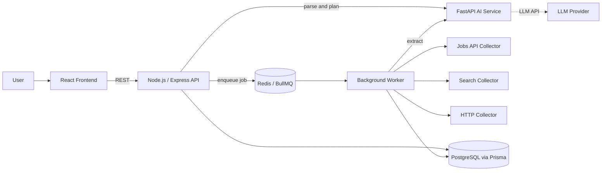

<div align="center">


# ScoutFlow

**Describe the data you need in plain English. ScoutFlow finds it, cleans it, and hands you a source-backed dataset.**

[](https://scout-flow-lovat.vercel.app/)


[Live Demo](https://scout-flow-lovat.vercel.app/) · [Getting Started](#-getting-started) · [API Reference](#-api-reference) · [Roadmap](#-roadmap)

</div>

---

## Table of Contents

- [Overview](#-overview)
- [Why ScoutFlow](#-why-scoutflow)
- [Key Features](#-key-features)
- [How It Works](#-how-it-works)
- [Architecture](#-architecture)
- [Tech Stack](#-tech-stack)
- [Project Structure](#-project-structure)
- [Getting Started](#-getting-started)
- [Configuration](#-configuration)
- [Using ScoutFlow](#-using-scoutflow)
- [API Reference](#-api-reference)
- [Data Model](#-data-model)
- [Security](#-security)
- [Deployment](#-deployment)
- [Known Limitations](#-known-limitations)
- [Roadmap](#-roadmap)
- [Contributing](#-contributing)
- [License](#-license)

---

## Overview

**ScoutFlow** is an AI-powered data intelligence platform. Instead of writing a scraper for every new question, you describe what you need in a sentence:

> *"Find 50 AI internships in India posted in the last 7 days. Return company, role, location, salary, posting date and application URL."*

ScoutFlow understands the request, plans a collection workflow, gathers data from permitted sources in the background, then cleans, validates, and deduplicates the results into a structured dataset. Every record keeps a link back to the source it came from, so the output is something you can verify, not just trust.

**Live demo:** [https://scout-flow-lovat.vercel.app/](https://scout-flow-lovat.vercel.app/)

---

## Why ScoutFlow

Teams constantly need specific, current information from the web: job openings, sales leads, sponsor opportunities, market data, company details. Getting it today usually means one of three bad options:

| Approach | The problem |
|---|---|
| Manual research | Slow, inconsistent, and impossible to repeat |
| One-off scrapers | Every new requirement needs a new script, and each one breaks when a site changes |
| Raw LLM answers | No provenance, no validation, and no way to tell a fact from a guess |

ScoutFlow closes that gap. It turns a plain-English requirement into a **managed, observable, repeatable workflow** and produces a dataset where every row is validated, deduplicated, and traceable to its source.

---

## Key Features

### Understand
- **Natural-language requirements.** Describe entities, fields, location, time window, and quantity in plain English.
- **Structured interpretation.** The AI converts your request into a validated specification that the rest of the system runs on.
- **Workflow planning.** The AI chooses and orders steps from a fixed set of safe operations. It never generates or executes code.

### Collect
- **Background execution.** Jobs run on a Redis-backed BullMQ queue, off the HTTP request cycle.
- **Multi-source collection.** A public jobs API plus a configurable search provider, behind a pluggable collector interface.
- **Resilient by design.** One failing source never fails the whole task, and failures are recorded rather than hidden.
- **Honest fallback.** If no real source is reachable, ScoutFlow can fall back to demo data and clearly labels the dataset as mock.

### Clean and Trust
- **Normalization.** Locations, dates, URLs, salaries, and whitespace are standardized with deterministic code, not an LLM.
- **Validation.** Each record is marked `VALID`, `PARTIAL`, or `INVALID`, with the reasons retained.
- **Deduplication.** Duplicate listings are detected and removed using an explainable key.
- **Full provenance.** Every record links back to its source through a **View Source** action.

### Manage and Explore
- **Live progress.** Watch a pipeline checklist, statistics, and a timestamped execution log while a task runs.
- **Task control.** Cancel, retry, rerun, and delete tasks. Cancellation is cooperative, so no work is left half-written.
- **Versioning.** Every rerun creates a new dataset version and a new workflow version, and older ones stay inspectable.
- **Dataset explorer.** Search, filter, sort, and paginate server-side, then open any record in a details drawer.
- **Source health.** See which sources succeeded or failed for each task.
- **Export.** Download datasets as CSV or JSON.
- **Polished UI.** Dark mode, loading skeletons, empty and error states, toast notifications, and a responsive layout.

---

## How It Works

```
 1. DESCRIBE      "Find 50 AI internships in India posted in the last 7 days..."
        |
 2. UNDERSTAND    AI parses the request into a structured requirement
        |         (entity, keywords, location, date range, limit, fields)
        |
 3. PLAN          AI selects the workflow steps, validated against an allow-list
        |
 4. COLLECT       Worker gathers data from multiple sources in the background
        |
 5. EXTRACT       Raw content becomes structured records
        |
 6. NORMALIZE     Locations, dates, URLs, and salaries are standardized
        |
 7. DEDUPLICATE   Duplicate records are removed
        |
 8. VALIDATE      Each record is marked VALID, PARTIAL, or INVALID
        |
 9. STORE         A versioned dataset is saved with per-record provenance
        |
10. EXPLORE       Search, filter, inspect sources, and export
```

The AI service handles only the parts that need language understanding: parsing the request, planning the workflow, and extracting fields from unstructured text. Everything else is plain deterministic code, which keeps runs fast, cheap, and reproducible.

---

## Architecture



**Design principle: the AI is never trusted blindly.**

- The AI service returns **structured JSON only**, validated with **Pydantic**.
- The Node backend **re-validates** every AI response with **Zod** before saving or acting on it.
- Workflow steps are restricted to a fixed allow-list (`search`, `collect`, `extract`, `normalize`, `filter`, `validate`, `deduplicate`, `store`). The AI picks and orders them, and the backend owns every implementation.
- The AI never touches the database and never executes arbitrary code.

---

## Tech Stack

| Layer | Technology |
|---|---|
| **Frontend** | React 19, Vite, React Router, Tailwind CSS, Axios |
| **Backend** | Node.js, Express, Prisma ORM, Zod, Cheerio, json2csv |
| **Job Queue** | BullMQ, Redis (ioredis) |
| **AI Service** | Python, FastAPI, Pydantic, OpenAI-compatible LLM API (Groq by default) |
| **Database** | PostgreSQL with JSONB for flexible record data |
| **Deployment** | Vercel (frontend), Docker-friendly services |

---

## Project Structure

```
scoutflow/
├── frontend/                     React + Vite + Tailwind
│   └── src/
│       ├── api/                  API client
│       ├── components/           Sidebar, StatusBadge, PipelineChecklist, Skeleton, ...
│       ├── context/              Theme and toast providers
│       └── pages/                Dashboard, CreateTask, TaskDetail, Workflow,
│                                 Dataset, Sources, History
│
├── backend/                      Node.js + Express + Prisma
│   ├── prisma/
│   │   ├── schema.prisma
│   │   └── migrations/
│   └── src/
│       ├── collectors/           demo, HTTP, search, and jobs-API collectors
│       ├── config/               environment loading, Prisma client
│       ├── controllers/          thin HTTP handlers
│       ├── middleware/           error handling
│       ├── queue/                BullMQ connection, queue, and worker
│       ├── routes/
│       ├── services/             task, workflow, collection, extraction,
│       │                         pipeline, export, and AI client logic
│       └── utils/                normalize, dedupe, validate, URL safety
│
└── ai-service/                   Python + FastAPI
    └── app/
        ├── models/               Pydantic contracts
        ├── prompts/              LLM system prompts
        └── services/             requirement parser, workflow planner, extractor
```

---

## Getting Started

### Prerequisites

- **Node.js** 18 or newer
- **Python** 3.10 or newer
- **PostgreSQL** 14 or newer
- **Redis** (the quickest route is Docker)

### 1. Clone the repository

```bash
git clone <your-repo-url> scoutflow
cd scoutflow
```

### 2. Start the database and Redis

```bash
createdb ai_data_intel

docker run -d --name redis -p 6379:6379 redis:7-alpine
```

### 3. Start the AI service

```bash
cd ai-service
python3 -m venv venv
source venv/bin/activate        # Windows: venv\Scripts\activate
pip install -r requirements.txt
cp .env.example .env            # add your LLM_API_KEY
uvicorn app.main:app --reload --port 8000
```

### 4. Start the backend

Open a new terminal:

```bash
cd backend
npm install
cp .env.example .env            # set DATABASE_URL and ADMIN_TOKEN
npx prisma generate
npx prisma migrate dev
npm run dev                     # http://localhost:5000
```

The API and the background worker run together in one process by default.

### 5. Start the frontend

Open a new terminal:

```bash
cd frontend
npm install
cp .env.example .env
npm run dev                     # http://localhost:5173
```

Open **http://localhost:5173**, enter your access token when prompted, and create your first task.

---

## Configuration

### `backend/.env`

| Variable | Description | Default |
|---|---|---|
| `PORT` | API port | `5000` |
| `DATABASE_URL` | PostgreSQL connection string | none, required |
| `AI_SERVICE_URL` | URL of the FastAPI service | `http://localhost:8000` |
| `ADMIN_TOKEN` | Access token the frontend prompts for | none, required |
| `DEMO_MODE` | Use seeded demo data instead of live collection | `false` |
| `REDIS_URL` | Redis connection string | `redis://localhost:6379` |
| `WORKER_MODE` | `in-process` or `separate` | `in-process` |
| `TASK_CONCURRENCY` | Jobs processed in parallel | `3` |
| `TASK_MAX_ATTEMPTS` | Automatic retries per job | `2` |
| `SEARCH_PROVIDER` | Optional search or jobs API endpoint | empty |
| `SEARCH_API_KEY` | Key for the search provider | empty |

### `ai-service/.env`

| Variable | Description | Default |
|---|---|---|
| `PORT` | Service port | `8000` |
| `LLM_API_KEY` | API key for the LLM provider | empty |
| `LLM_MODEL` | Model name | `llama-3.1-8b-instant` |
| `LLM_BASE_URL` | OpenAI-compatible base URL | `https://api.groq.com/openai/v1` |

If `LLM_API_KEY` is not set, the AI service automatically falls back to deterministic rule-based parsing, so the pipeline still runs.

### `frontend/.env`

| Variable | Description | Default |
|---|---|---|
| `VITE_API_URL` | Base URL of the backend API | `http://localhost:5000/api` |

### Running the worker separately

For production-style scaling, run the API and worker as independent processes:

```bash
# backend/.env
WORKER_MODE=separate
```

```bash
npm run dev       # API
npm run worker    # worker, in a second terminal
```

---

## Using ScoutFlow

1. **Create a task.** Go to **Create Task** and describe what you need. Try:
   - `Find 50 AI internships in India posted in the last 7 days. Return company, role, location, salary, posting date and application URL.`
   - `Find backend development internships in Bangalore and return company, role, location, salary, date posted and application URL.`
2. **Watch it run.** The task moves through `QUEUED → PLANNING → RUNNING → COMPLETED` with a live pipeline checklist, statistics, and execution log.
3. **Inspect the workflow.** Open **View Workflow** to see the plan the AI generated. After a rerun, use the version dropdown to revisit earlier plans.
4. **Explore the dataset.** Search, filter by location or validation status, sort, and open any record for full details.
5. **Verify the source.** Click **View Source** on any record to see where the data came from.
6. **Export.** Download the dataset as CSV or JSON.
7. **Manage the task.** Cancel a running task, rerun a finished one to create a new dataset version, or delete tasks you no longer need.

---

## API Reference

All endpoints are prefixed with `/api`.

### Tasks

| Method | Path | Description |
|---|---|---|
| `POST` | `/tasks` | Create a task and enqueue it |
| `GET` | `/tasks` | List tasks (`?page&limit&status`) |
| `GET` | `/tasks/:id` | Task detail |
| `POST` | `/tasks/:id/run` | Rerun or retry a task |
| `POST` | `/tasks/:id/cancel` | Request cancellation |
| `DELETE` | `/tasks/:id` | Delete a task (`409` while active) |
| `GET` | `/tasks/:id/logs` | Execution log |

### Workflows

| Method | Path | Description |
|---|---|---|
| `GET` | `/tasks/:id/workflow` | Latest workflow (`?version=N` for a specific one) |
| `GET` | `/tasks/:id/workflow/versions` | All workflow versions for a task |

### Datasets and records

| Method | Path | Description |
|---|---|---|
| `GET` | `/tasks/:id/dataset` | Latest dataset (`?version=N` for a specific one) |
| `GET` | `/tasks/:id/dataset/versions` | All dataset versions with record counts |
| `GET` | `/tasks/:id/records` | Records (`?page&limit&search&location&status&sort&version`) |
| `GET` | `/tasks/:id/export/csv` | Download as CSV |
| `GET` | `/tasks/:id/export/json` | Download as JSON |

### Sources and stats

| Method | Path | Description |
|---|---|---|
| `GET` | `/sources` | List sources (`?taskId&status&page&limit`) |
| `GET` | `/sources/health/:taskId` | Per-status source counts for a task |
| `GET` | `/sources/:id` | Single source |
| `GET` | `/stats` | Dashboard counters and recent tasks |
| `GET` | `/health` | Health check |

### AI service (internal)

| Method | Path | Description |
|---|---|---|
| `POST` | `/ai/parse-requirement` | Natural language to structured requirement |
| `POST` | `/ai/plan-workflow` | Requirement to ordered workflow steps |
| `POST` | `/ai/extract` | Raw content to structured fields |
| `GET` | `/health` | Health check |

---

## Data Model

| Model | Purpose |
|---|---|
| `Task` | One natural-language request, its status, and the structured requirement |
| `Workflow` | A versioned plan generated by the AI for a task |
| `Source` | Every collection attempt, with status, errors, and check time |
| `Dataset` | A versioned result set, flagged when built from mock data |
| `Record` | One validated data row with its status, dedupe key, and source link |
| `ExecutionLog` | An append-only, timestamped history of each pipeline step |

Record data is stored as JSONB, so the same schema supports different dataset types without migrations.

---

## Security

- **AI output is validated twice.** Pydantic on the Python side and Zod on the Node side.
- **No arbitrary code execution.** Workflow steps come from a fixed allow-list.
- **SSRF protection.** Every outbound fetch is limited to `http` and `https`, resolved, and checked against private, loopback, link-local, and cloud-metadata ranges. Redirects are re-validated at every hop.
- **SQL injection safe.** All database access goes through Prisma's parameterized queries.
- **Secrets stay server-side.** API keys live in `.env` files and are never sent to the browser.
- **Bounded requests.** Timeouts are set on every outbound call.

---

## Deployment

The frontend is deployed on **Vercel** at [scout-flow-lovat.vercel.app](https://scout-flow-lovat.vercel.app/).

A full deployment needs four pieces running:

| Component | Requirement |
|---|---|
| Frontend | Static hosting (Vercel, Netlify, or similar) with `VITE_API_URL` pointing at your API |
| Backend | A Node.js host with access to PostgreSQL and Redis |
| AI service | A Python host reachable from the backend at `AI_SERVICE_URL` |
| Data stores | Managed PostgreSQL and Redis |

Run `npx prisma migrate deploy` against your production database before starting the backend.

---

## Known Limitations

- **Access control.** Authentication is a single shared token (`ADMIN_TOKEN`). Per-user accounts and data ownership are not implemented yet.
- **Collectors.** One live integration (a public jobs API) plus a configurable search-provider interface. There are no site-specific scrapers or browser-rendered collectors yet.
- **Deduplication.** Detection is exact-key based, not fuzzy or entity-resolving.
- **Versioning.** Dataset and workflow versions are stored as independent snapshots, without a diff view.
- **Job monitoring.** Redis and BullMQ run as a single instance without a monitoring dashboard.
- **Deletion.** Deleting a task is permanent, with no archive or recovery.
- **DNS rebinding.** SSRF checks do not defend against an IP that changes between validation and request.

---

## Roadmap

- [ ] Per-user accounts with data isolation
- [ ] Editable AI interpretation before a task runs
- [ ] Signal-based confidence scoring per record
- [ ] Fuzzy matching and cross-source entity resolution
- [ ] Version-to-version dataset diffs (added, removed, updated records)
- [ ] Dataset analytics and distributions
- [ ] Additional collectors: structured data (JSON-LD), RSS, and browser-rendered pages
- [ ] XLSX export
- [ ] Task search by prompt text
- [ ] Docker Compose for one-command deployment
- [ ] Archive and restore for deleted tasks

---

## Contributing

Contributions are welcome.

1. Fork the repository
2. Create a branch: `git checkout -b feature/your-feature`
3. Commit your changes: `git commit -m "Add your feature"`
4. Push the branch: `git push origin feature/your-feature`
5. Open a pull request

New collectors are a good place to start. Implement the `{ sourceUrl, sourceType, rawContent }` shape in `backend/src/collectors/` and register it in `collectionService.js`.

---

## License

Add your license here (for example, MIT) and include a `LICENSE` file at the repository root.

---

<div align="center">

**ScoutFlow** · Ask in plain English. Get data you can trace.

[Live Demo](https://scout-flow-lovat.vercel.app/)

</div>